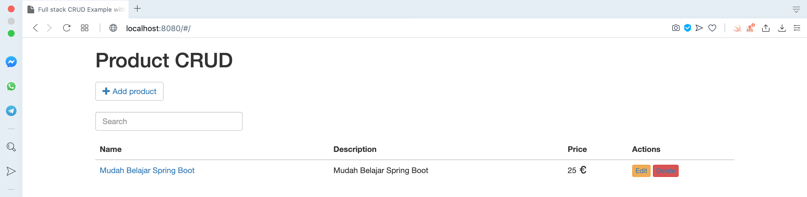
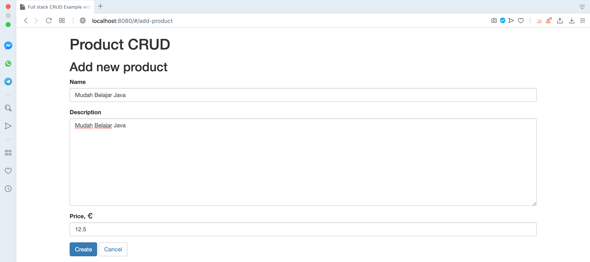
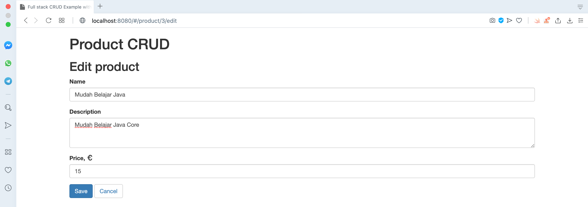
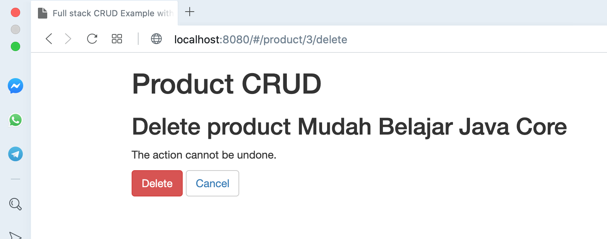

# springboot-crud-mysql-vuejs

## Thing to do:
1. Clone this repository: `git clone https://github.com/hendisantika/springboot-crud-mysql-vuejs.git`.
2. Go to the folder: `cd springboot-crud-mysql-vuejs`.
3. Run the application: `mvn clean spring-boot:run`.
4. Open your favorite browser. Then navigate to http://localhost:8080

## Screen shot

**List Product**

**Add New Product**

**Edit Product**

**Delete Product**

